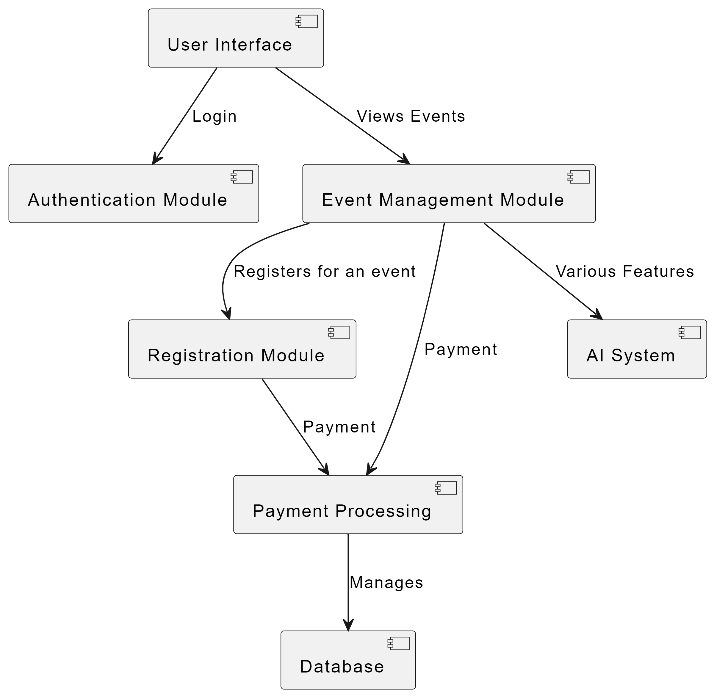
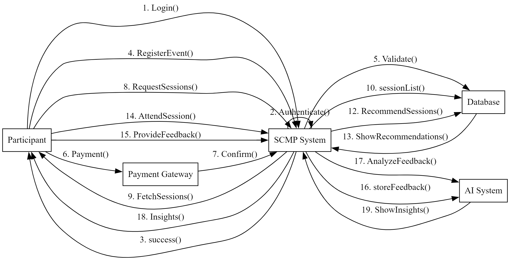
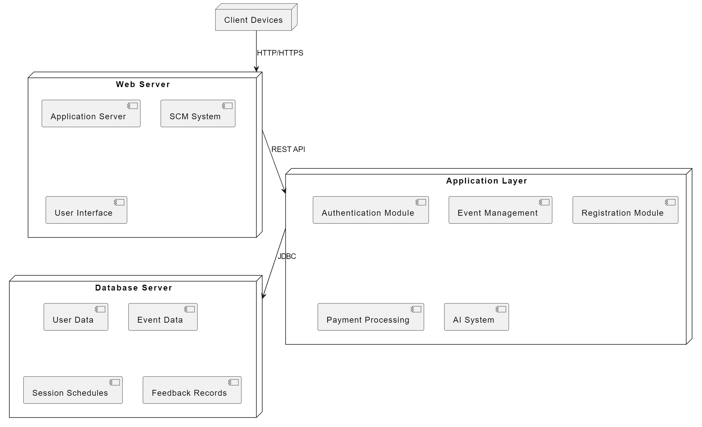
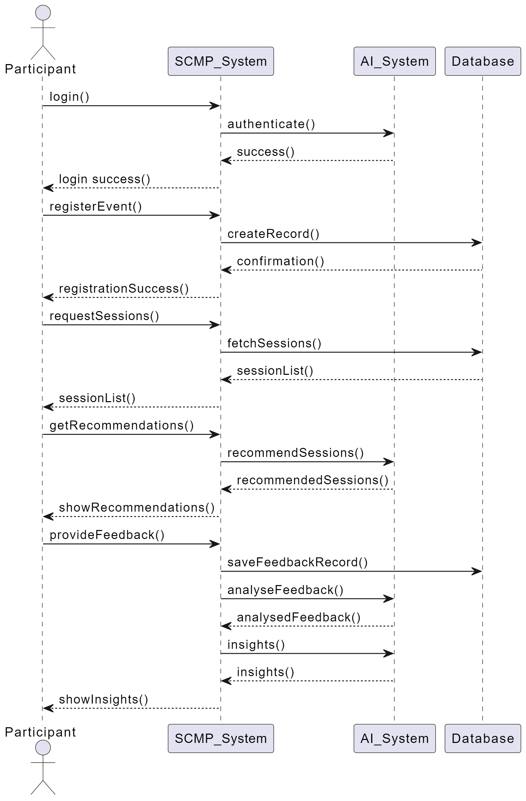
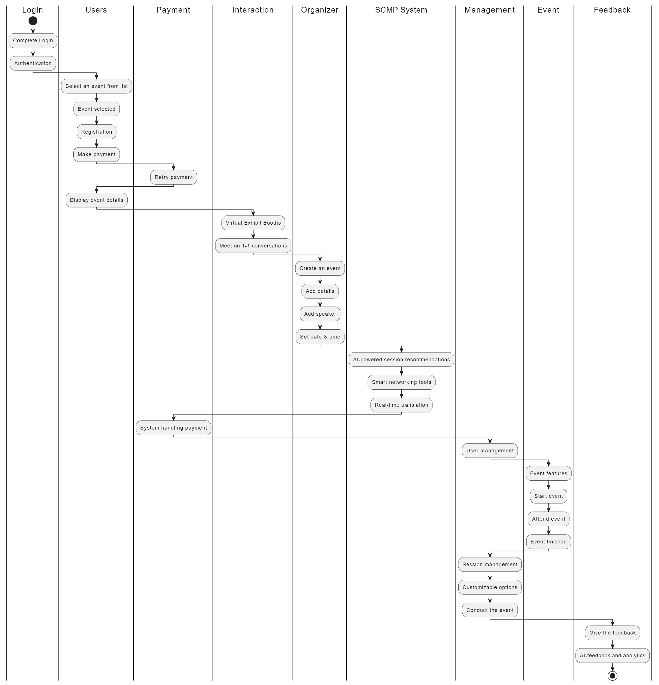

# Smart Conference Management Platform (SCMP) System Design

This repository contains Object-Oriented Software Engineering (OOSE) models for the **Smart Conference Management Platform**. These diagrams provide a comprehensive overview of the system's design, workflows, and structure.

## Project Overview
The **Smart Conference Management Platform** is a system designed to streamline the process of organizing and managing conferences. It includes features for event scheduling, participant registration, session tracking, and feedback collection.

## Access the Live Website:
You can view the live website here: [Smart Conference Management Platform](https://bharathyadav2004.github.io/Smart-Conference-Management-Platform/)

## Features
- **Event Creation and Scheduling**: Tools for organizers to create and manage events.
- **Participant Registration**: Secure and intuitive registration process.
- **Session Management**: Organizers can manage speakers and session details.
- **AI-Driven Insights**: Feedback analytics and session recommendations.
- **Real-Time Translation**: Accessibility for multilingual participants.
- **Gamification**: Engagement through networking and point systems.

## Included Diagrams

### 1. **Activity Diagram**
   - **Description**: Visualizes the workflow of the conference management system, including key processes like registration, session allocation, and feedback collection.
   - **Purpose**: Demonstrates the flow of activities and decision points within the system.
   - **Diagram**:  
     

---

### 2. **Use Case Model**
   - **Description**: Illustrates the interactions between different actors (e.g., organizers, participants) and the system.
   - **Purpose**: Highlights the system's functionalities and the roles involved.
   - **Diagram**:  
     

---

### 3. **Class Diagram**
   - **Description**: Represents the static structure of the system, including classes, attributes, methods, and their relationships.
   - **Purpose**: Defines the core objects and their interconnections.
   - **Diagram**:  
     

---

### 4. **Collaboration Diagram**
   - **Description**: Depicts how objects interact to perform a specific task or workflow.
   - **Purpose**: Provides a dynamic view of the system's object interactions.
   - **Diagram**:  
     

---

### 5. **Deployment Diagram**
   - **Description**: Demonstrates the physical deployment of artifacts (e.g., software components) on hardware nodes.
   - **Purpose**: Shows how the system will be implemented in a real-world environment.
   - **Diagram**:  
     

---

### 6. **Sequence Diagram**
   - **Description**: Details the sequence of interactions between objects for specific functionalities, such as user registration or session creation.
   - **Purpose**: Provides a timeline-based view of system interactions.
   - **Diagram**:  
     

---

### 7. **Swimlane Diagram**
   - **Description**: Organizes processes and workflows into lanes to specify responsibilities across different roles or departments.
   - **Purpose**: Clarifies accountability and role-specific tasks.
   - **Diagram**:  
     

---

### 8. **Component Diagram**
   - **Description**: Visualizes the structure of the system in terms of software components and their dependencies.
   - **Purpose**: Highlights the modularity of the system.
   - **Diagram**:  
     

---

### 9. **Statechart Diagram**
   - **Description**: Captures the states and transitions within the system, such as the lifecycle of a participant or a session.
   - **Purpose**: Explains the behavior of the system or its components in response to events.
   - **Diagram**:  
     

---

## Folder Structure
Smart-Conference-Management-Platform/
├── README.md
├── Diagrams/
│   ├── UseCaseDiagram/
│   │   ├── use_case_diagram.png
│   │   └── descriptions.txt
│   ├── ClassDiagram/
│   │   ├── class_diagram.png
│   │   └── descriptions.txt
│   ├── SequenceDiagram/
│   │   ├── sequence_diagram.png
│   │   └── descriptions.txt
│   ├── ActivityDiagram/
│   │   ├── activity_diagram.png
│   │   └── descriptions.txt
│   ├── StateDiagram/
│   │   ├── state_diagram.png
│   │   └── descriptions.txt
│   ├── ComponentDiagram/
│   │   ├── component_diagram.png
│   │   └── descriptions.txt
│   ├── DeploymentDiagram/
│   │   ├── deployment_diagram.png
│   │   └── descriptions.txt
├── Testing/
│   ├── test_suites.md
│   └── sample_test_cases.md
├── Requirements/
│   ├── functional_requirements.md
│   ├── non_functional_requirements.md
│
└── LICENSE

---

#LICENSE

### **Key Files**

#### **1. Diagrams**
Each folder (`UseCaseDiagram`, `ClassDiagram`, etc.) contains:
- **Image files** of the respective diagrams.
- A `descriptions.txt` file with an explanation of the diagram and its components.

#### **2. Requirements**
- **`functional_requirements.md`**: Lists functional requirements, such as secure login, event management, and session recommendations.
- **`non_functional_requirements.md`**: Details performance, scalability, and security benchmarks.
- **`database_requirements.md`**: Includes schema descriptions for storing events, users, sessions, and feedback.

#### **3. Testing**
- **`test_suites.md`**: Comprehensive test cases for various functionalities like event creation and participant registration.
- **`sample_test_cases.md`**: Example test cases with inputs, expected outputs, and priorities.

#### **4. CodeSamples**
Prototype scripts for:
- User authentication (`main.py`).
- Database setup (`database_schema.sql`).
- Utility functions for email and notifications (`utilities.py`).

---

### Next Steps
1. **Gather the Visuals**: Upload all UML diagram images to their respective folders.
2. **Write the Code**: Add Python scripts or prototypes for essential features.
3. **Test Suite Execution**: Document sample results from test cases.
4. **Upload to GitHub**: Push the structured repository to GitHub.

Let me know if you need help implementing this structure!
